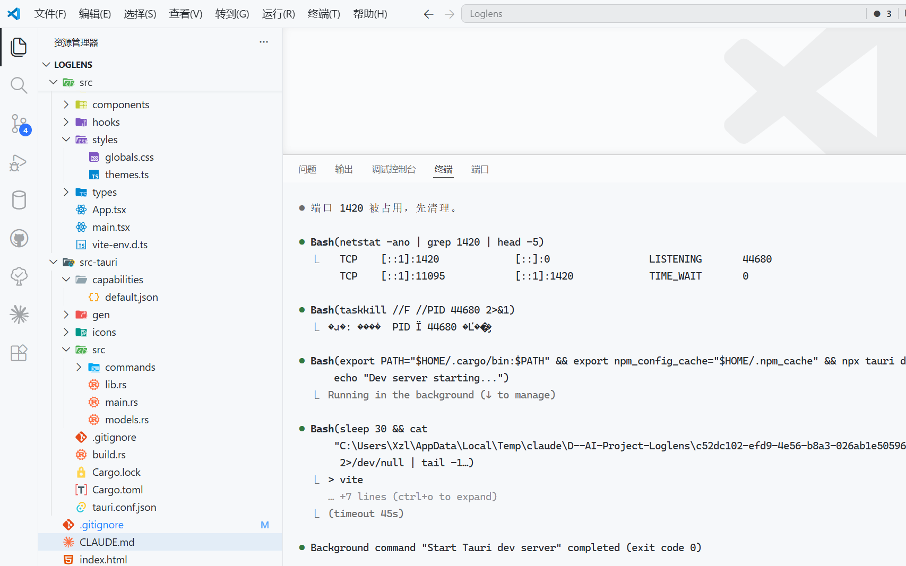

<div align="center">

# LogLens

**智能日志透视仪 | Smart Log Viewer with AI Analysis**

[](LICENSE)
[](https://tauri.app)
[](https://react.dev)
[](https://www.typescriptlang.org)
[](https://www.rust-lang.org)

[English](#english) | [中文](#中文)

</div>

---

## English

### Why LogLens?

Developers and DevOps engineers waste hours scrolling through massive log files trying to find errors. LogLens makes this instant — load 500MB+ files in seconds, auto-highlight errors, fold Java stack traces, and get AI-powered root cause analysis with one click.

### Features

| Feature | Description |
|---------|-------------|
| **Blazing fast** | Stream-load 500MB+ log files with virtual scrolling — no UI lag |
| **Smart parsing** | Auto-detect log levels (ERROR/WARN/INFO/DEBUG), timestamps, Java stack traces |
| **Stack folding** | One-click collapse/expand Java exception stack traces |
| **Real-time filter** | Keyword search with regex mode, multi-level log filtering |
| **AI analysis** | Hover on ERROR lines → instant AI diagnosis with streaming Markdown |
| **Tail mode** | Real-time file watching, new lines append automatically |
| **6 themes** | Darcula, IntelliJ Light, High Contrast, Monokai, Solarized Dark, Nord |
| **Keyboard shortcuts** | `Ctrl+O` open, `Ctrl+F` search, `T` tail, `Ctrl+Scroll` zoom |

### Screenshots

| Drop Zone | Log Viewer |
|-----------|------------|
|  |  |

| Settings & Themes | AI Analysis |
|-------------------|-------------|
|  |  |

### Quick Start

#### Prerequisites

- [Node.js](https://nodejs.org/) >= 18
- [Rust](https://rustup.rs/) >= 1.70
- [Tauri Prerequisites](https://tauri.app/start/prerequisites/)

#### Run

```bash
git clone https://github.com/Realist1234/loglens.git
cd loglens
npm install
npm run tauri dev
```

#### Build

```bash
npm run tauri build
```

### AI Configuration

Open Settings (`Ctrl+,`) to configure:

| Field | Default | Description |
|-------|---------|-------------|
| API Key | *(empty)* | Your API key |
| Base URL | `https://api.anthropic.com` | Supports OpenAI-compatible endpoints |
| Model | `claude-3-5-sonnet-20241022` | Model name |
| HTTP Proxy | *(empty)* | Optional, e.g. `http://127.0.0.1:7890` |

> Ask AI currently uses mock responses. Real API integration coming soon.

### Keyboard Shortcuts

| Shortcut | Action |
|----------|--------|
| `Ctrl+O` | Open file |
| `Ctrl+F` | Focus search |
| `Ctrl+,` | Settings |
| `Escape` | Close sidebar / settings |
| `T` | Toggle tail mode |
| `Home` / `End` | Jump to top / bottom |
| `Ctrl+Scroll` | Zoom font |

### Tech Stack

| Layer | Technology |
|-------|-----------|
| Frontend | React 18, TypeScript, Tailwind CSS |
| Virtual Scroll | @tanstack/react-virtual |
| Backend | Rust (Tauri 2.0) |
| File Watch | notify crate |
| AI | OpenAI / Anthropic compatible |
| Storage | @tauri-apps/plugin-store |

### License

[MIT](LICENSE)

---

## 中文

### 为什么选择 LogLens？

后端开发和运维工程师每天花大量时间在海量日志中翻找错误。LogLens 让这一切瞬间完成——秒开 500MB+ 日志文件，自动高亮错误，一键折叠 Java 堆栈，点击即可获得 AI 根因分析。

### 功能亮点

| 功能 | 说明 |
|------|------|
| **大文件秒开** | 流式加载 500MB+ 日志，虚拟滚动零卡顿 |
| **智能解析** | 自动识别日志级别、时间戳、Java 堆栈 |
| **堆栈折叠** | 一键折叠/展开 Java 异常堆栈 |
| **实时过滤** | 关键字搜索支持正则，多级别过滤 |
| **AI 排错** | Hover ERROR 行 → AI 根因分析，流式 Markdown 渲染 |
| **Tail 跟踪** | 实时监听文件变化，自动追加新日志 |
| **6 款主题** | Darcula、IntelliJ Light、高对比度、Monokai、Solarized、Nord |
| **快捷键** | `Ctrl+O` 打开、`Ctrl+F` 搜索、`T` Tail、`Ctrl+滚轮` 缩放 |

### 界面截图

| 落地区域 | 日志查看器 |
|----------|------------|
|  |  |

| 设置 & 主题 | AI 分析 |
|-------------|---------|
|  |  |

### 快速开始

#### 环境要求

- [Node.js](https://nodejs.org/) >= 18
- [Rust](https://rustup.rs/) >= 1.70
- [Tauri 环境依赖](https://tauri.app/start/prerequisites/)

#### 运行

```bash
git clone https://github.com/Realist1234/loglens.git
cd loglens
npm install
npm run tauri dev
```

#### 构建

```bash
npm run tauri build
```

### AI 配置

打开设置（`Ctrl+,`）配置：

| 字段 | 默认值 | 说明 |
|------|--------|------|
| API Key | *（空）* | 你的 API Key |
| API 地址 | `https://api.anthropic.com` | 支持 OpenAI 兼容格式 |
| 模型 | `claude-3-5-sonnet-20241022` | 模型名称 |
| HTTP 代理 | *（空）* | 可选，如 `http://127.0.0.1:7890` |

> 当前 Ask AI 为模拟回复，真实 API 对接即将上线。

### 快捷键

| 快捷键 | 功能 |
|--------|------|
| `Ctrl+O` | 打开文件 |
| `Ctrl+F` | 聚焦搜索 |
| `Ctrl+,` | 设置 |
| `Escape` | 关闭侧边栏 / 设置 |
| `T` | 切换 Tail 模式 |
| `Home` / `End` | 跳转首行 / 末行 |
| `Ctrl+滚轮` | 缩放字体 |

### 技术栈

| 层级 | 技术 |
|------|------|
| 前端 | React 18, TypeScript, Tailwind CSS |
| 虚拟滚动 | @tanstack/react-virtual |
| 后端 | Rust (Tauri 2.0) |
| 文件监听 | notify crate |
| AI 集成 | OpenAI / Anthropic 兼容 |
| 持久化 | @tauri-apps/plugin-store |

### 开源协议

[MIT](LICENSE)

---

## Star History

[](https://star-history.com/#Realist1234/loglens&Date)
